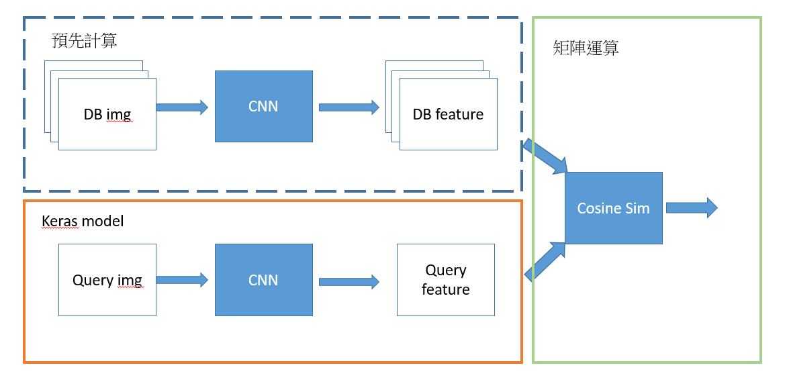
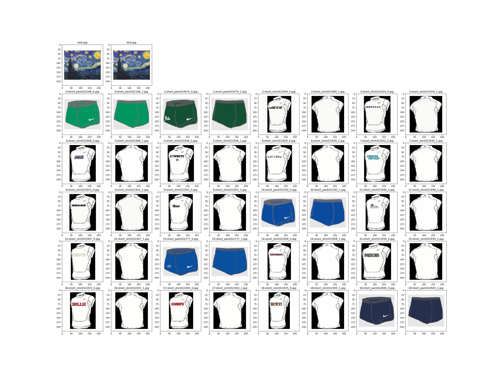
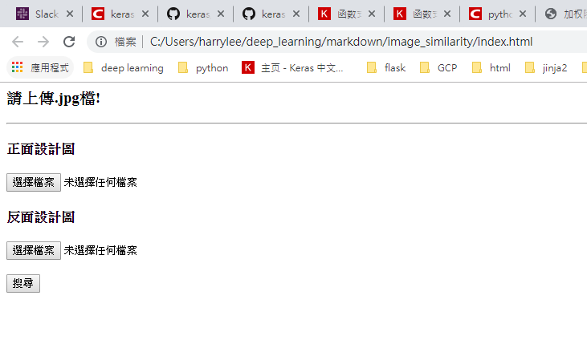
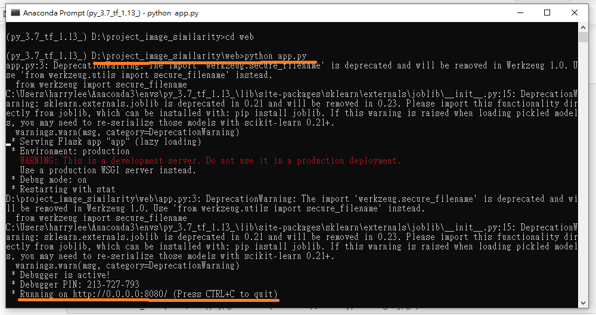
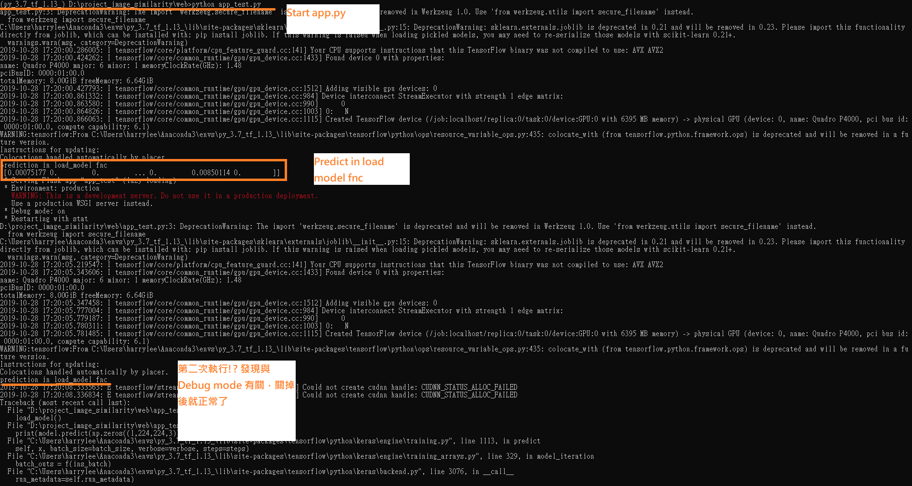

# Deploying Image Similarity Deep Laerning Model by Flask,Redis and Keras

第一次部屬深度學習模型，紀錄實做時遇到的一些狀況

## 1. Image Similarity Model

影像相似度的問題，有許多深度學習的方法，如Siamese network, Triplet network...等衍生出來的模型。<br>
此次任務目標為使用者輸入1組query image pair之後，從系統資料庫中找出其最相似的一組image pair。(image pair 中包含一張設計圖的正面與反面。)<br>
對於這次的任務經典的Siamese network足以完成工作，最後的實驗結果以 Cosine Similarity 作為相似度函數 比 L2 distance 效果來的好。<br><br>
基本的模型架構如下:<br>

Siamese network


簡單來說這個模型就是利用CNN分別抽取兩張圖片的特徵，經過Merge去計算定義好的影像相似度。<br>

直觀的做法是從資料庫中撈取image pair，並結合使用者的影像丟入Network中計算影像相似度。<br>
但是這個方法有嚴重的缺陷，譬如說速度太慢、或是佔用太多記憶體。(最後需要把此API放在GCP，RAM的多寡、是否使用GPU等會影響到費用)<br>
一組(224,224)的image pair，比對資料庫的約三千組的圖片需花費60秒。其中資料庫的影像已經先讀取好並做前處理，占用3.3GB RAM<br>
(使用8G ram 的 GPU, batch=32)

為了減少運算時間與占用的記憶體，先將資料庫的影像都預先計算其image features，以.npy檔保存。<br>
實際在運算時，只有使用者查詢的影像會經過CNN model 抽取 image feature，並與資料庫的feature做矩陣運算。<br>
這樣的話一組影像的計算時間約為0.5秒，image features 占用 550 MB RAM<br>
整體流程如下:<br>



### import moudle


```python
import os
from flask import Flask, render_template, request, redirect, url_for, send_file
from werkzeug.utils import secure_filename
import pandas as pd
import numpy as np
from PIL import Image
import PIL.ImageOps
from tensorflow.keras.applications.vgg16 import VGG16 , preprocess_input
from tensorflow.keras import Model
from tensorflow.keras.layers import Lambda,Flatten
import tensorflow.keras.backend as K
import matplotlib.pyplot as plt
import tensorflow as tf
import redis,base64,sys,uuid,json,time
from threading import Thread
```

### Function Introduction

#### load_data_directory
讀取資料庫的image feature，與影像名稱


```python
def load_data_directory():
    img_list=pd.read_csv('name_list.csv') 
    return img_list , np.load('img_feature_f.npy'),np.load('img_feature_b.npy')
```

#### load_model 
CNN model 使用pre-trained 的VGG16全卷積層最後一層的輸出作為影像特徵，並做Flatten與 L2-normalize。<br>
當然paper 上有很多其他不同的結構，例如抽取CNN淺層特徵...等，視需求做修改即可


```python
def load_model():
    vgg16=VGG16(weights='imagenet',include_top=False) #no fc layer , output shape = (7,7,512)
    flat=Flatten()(vgg16.output)
    l2_norm=Lambda(lambda x: K.l2_normalize(x,axis=1))(flat)
    model=Model(vgg16.input , l2_norm)
    return model
```

#### resize_aspect_ratio
是一個等比縮放的function，因為這次任務的影像是衣服的設計圖，所以長寬比可能是重要的。


```python
def resize_aspect_ratio(img,size): 
    w,h=img.size #col , row
    target_w , target_h = size
    ratio=min(target_w/w , target_h/h)
    new_img=img.resize( (int(w*ratio),int(h*ratio)) )
    return new_img
```

#### padding
因為影像的大小不一，此功能將影像padding為固定相同的大小，本次任務的所有影像資料會先Resize至長邊=200後再padding成224*224。


```python
def padding(img,size,color=(255,255,255)):
    w,h=img.size #col , row
    target_w , target_h = size
    new_img=PIL.ImageOps.expand(img,((target_w-w)//2,(target_h-h)//2),color).resize(size)
    return new_img
```

#### searching_display
下面兩個function是將相似度比對後的結果輸出成影像，方便使用者確認<br>
top_20是最相似的前20名影像的index  [idx1, idx2,idx3...idx20]<br>
搜尋結果會類似下圖:(左上角是搜尋影像的正/反面，我隨便拿兩張圖去跑..)<br>


```python
def searching_display(top_20,imgs,img_name):
    row=5+1
    col=8
    fig=plt.figure(figsize=(4*col,4*row))
    img_f,img_b=imgs
    fig.add_subplot(row,col,1)
    plt.gca().set_title('{}'.format(img_name[0]))
    plt.imshow(img_f)
    fig.add_subplot(row,col,2)
    plt.gca().set_title('{}'.format(img_name[1]))
    plt.imshow(img_b)
    
    for i,index in enumerate(top_20):
        tmp_f=db_list['front'].iloc[index]
        tmp_b=db_list['back'].iloc[index]
        img_f=np.squeeze(imgs_preprocess_sect([tmp_f]))
        img_b=np.squeeze(imgs_preprocess_sect([tmp_b]))
        fig.add_subplot(row,col,i*2+1+8)
        plt.gca().set_title('{}:{}'.format(i,tmp_f))
        plt.imshow(img_f)
        fig.add_subplot(row,col,i*2+2+8)
        plt.gca().set_title('{}:{}'.format(i,tmp_b))
        plt.imshow(img_b)
    return fig
```


```python
def imgs_preprocess_sect(img_names,resize_size=(200,200),target_size=(224,224),directory='database/'):
    #param img_names: list of img name
    #output: np array for img (batch,row,col,channel)
    output=[]
    for name in img_names:
        img=Image.open(directory+name)
        img=resize_aspect_ratio(img,resize_size)
        img=padding(img,target_size)
        output.append(np.array(img))
    return np.array(output)
```



## 2.FLASK

從最簡單的架構開始


```python
app = Flask(__name__)
app.config['UPLOAD_FOLDER'] = 'uploads/'
app.config['DATABASE'] = 'database/'
app.config['ALLOWED_EXTENSIONS'] = set(['JPG','JPEG', 'png', 'jpg', 'jpeg', 'gif'])
```

#### allowed_file
用來確認使用者上傳的檔名是否為圖片檔，避免收到一堆奇怪的東西


```python
def allowed_file(filename):
    return '.' in filename and \
           filename.rsplit('.', 1)[1] in app.config['ALLOWED_EXTENSIONS']
```

#### index
index是User連到Server時，回傳首頁的function。用路徑" / "來修飾<br>
index.html畫面與內容如下，需要放置在". / templates / "內，render_template function才可正常執行


```python
@app.route('/')
def index():
    return render_template('index.html')
```


  
  
  


```python
<html lang="en">
  <head>
    <link href="//netdna.bootstrapcdn.com/bootstrap/3.0.0/css/bootstrap.min.css"
          rel="stylesheet">
  </head>
  <body>
    <div class="container">
      <div class="header">
        <h3 class="text-muted">請上傳.jpg檔!</h3>
      </div>
      <hr/>
      <div>
      
      <form action="upload" method="post" enctype="multipart/form-data">
        <h4 class="text-muted">正面設計圖</h4>
        <input type="file" name="file" ><br />
        <h4 class="text-muted">反面設計圖</h4>
        <input type="file" name="file2"><br /><br />
        <input type="submit" value="搜尋">
      </form>
      </div>
    </div>
  </body>
</html>
```

#### upload
在index 選好正反面的設計圖後，按下搜尋會發送兩個檔案給Server。<br>
Server 接收後會確認檔案的數量與格式，都符合後會儲存該檔案，並轉到uploaded_file function


```python
@app.route('/upload', methods=['POST'])
def upload():
    file = request.files['file']
    file2 = request.files['file2']
    
    if file and allowed_file(file.filename) and file2 and allowed_file(file2.filename):
        filename = secure_filename(file.filename)
        filename2 = secure_filename(file2.filename)
        file.save(os.path.join(app.config['UPLOAD_FOLDER'], filename))
        file2.save(os.path.join(app.config['UPLOAD_FOLDER'], filename2))
        return redirect(url_for('uploaded_file', filename=filename ,filename2=filename2))
```

#### uploaded_file
執行影像相似度搜尋的部分，因為在model端已經做完L2-normalization，所以兩個image feature做點積(Dot)就是Similarity<br>
正反面對於相似度的權重各為0.5，由np.argsort計算前設計圖相似度(sim_front)與後設計圖相似度(sim_back)的加總做排序。<br>
並將前20名數值最大的影像idx 傳入 Searching_display function 做搜尋結果的輸出。<br>
其檔案會存在 " ./output/"


```python
@app.route('/uploads/<filename>/<filename2>')
def uploaded_file(filename,filename2):

    model=load_model()
    img_f=Image.open("uploads/"+filename)
    img_f=resize_aspect_ratio(img_f,(200,200))
    img_f=padding(img_f,(224,224))
    img_f_in=preprocess_input(np.expand_dims(np.array(img_f),axis=0)) 
    query_feature_front = model.predict(img_f_in)[0]      
    sim_front=query_feature_front.dot(feature_f.T)
    
    img_b=Image.open("uploads/"+filename2)
    img_b=resize_aspect_ratio(img_b,(200,200))
    img_b=padding(img_b,(224,224))
    img_b_in=preprocess_input(np.expand_dims(np.array(img_b),axis=0))
    query_feature_back=model.predict(img_b_in)[0]
    sim_back=query_feature_back.dot(feature_b.T)
    top20=np.argsort(sim_front+sim_back)[-20:][::-1]
    
    fig=searching_display(top20,[img_f,img_b],[filename,filename2])
    fig.savefig('output/{}.jpg'.format(filename))    
    return send_file("output/{}.jpg".format(filename), mimetype='image/jpg')
```

主程式:


```python
if __name__ == '__main__':
    db_list , feature_f , feature_b =load_data_directory()
    #model=load_model()
    app.debug=True #Debug 模式
    app.run(host="127.0.0.1",port=int("5000"))
```

#### 測試
在cmd 執行:python app.py 便會開啟Server，圖片中使用port8080  
開啟瀏覽器輸入 127.0.0.1:8080 就可以進行圖片的上傳與測試  



## 在API中加載模型好嗎?
在上面的示例中，每一次的上傳圖片，都會使模型被重新加載一次，這其實是一個不好的做法。<br>
我把unloaded_file() 內的 load_model() 拿掉，在if __name__ =='__main__'中加入model=load_model()<br>
執行時會遇到類似下面的error:  
(我在本機跑這些function 都沒有問題，但是使用Flask，在model.predict() 就會遇到error)


```python
tensorflow.python.framework.errors_impl.FailedPreconditionError: 
Error while reading resource variable dense/kernel from
Container: localhost. This could mean that the variable was uninitialized. 
Not found: Container localhost does not exist. (Could not find resource: localhost/dense/kernel)
         [[{{node dense/MatMul/ReadVariableOp}}]]
```

查了一些國外的討論文章，大家有得出一些結論:<br>
1.<font color=blue size=2>在加載模型前創造一個固定的Session並用它加載模型</font><br>
2.<font color=blue size=2>在每次調用模型的時候使用同樣的graph 和 session</font><br>
load model function 修改如下:


```python
def load_model():
    global model
    global graph , sess
    graph=tf.get_default_graph()
    sess=tf.Session(graph=graph)
    K.set_session(sess)
    
    vgg16=VGG16(weights='imagenet',include_top=False) #no fc layer , output shape = (7,7,512)
    flat=Flatten()(vgg16.output)
    l2_norm=Lambda(lambda x: K.l2_normalize(x,axis=1))(flat)
    model=Model(vgg16.input , l2_norm)
    print("prediction in load_model fnc")
    print(model.predict(np.zeros((1,224,224,3))))
```

在使用模型的時候，使用下面的方式


```python
with graph.as_default():
    K.set_session(sess)
    model.predict(...)
```

然後我就遇到了第二個問題


```python
Error:Failed to get convolution algorithm. This is probably because cuDNN failed to initialize,
```

但是我並沒有在其他地方找到有人跟我一樣使用Flask的時候會遇到這個問題。  
試了許多方法都解決不了，有一陣子我放棄了，繼續在API中加載模型。

原先load_model 裡面沒有最後兩行  
加入最後兩行是因為後來我想要知道加載模型的當下模型是不是正常的  
結果我發現我遇到這個問題是因為Falsk打開debug mode之後會加載兩次，導致tf的graph 跟 session 出現了一些問題  
把Debug Mode 關掉就正常了，若要使用Debug Mode的話， app.run()中加入use_reloader=Flase 也可以正常執行


```python
if __name__ == '__main__':
    db_list , feature_f , feature_b =load_data_directory()
    load_model()
    
    app.debug=True
    app.run(host="0.0.0.0",port=int("5000"),use_reloader=False)
```



## 3.Redis


```python
待補充
```
